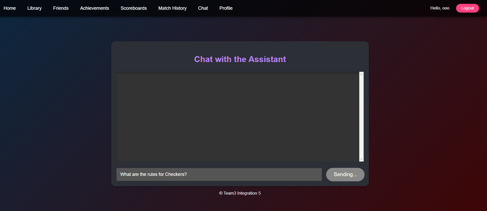
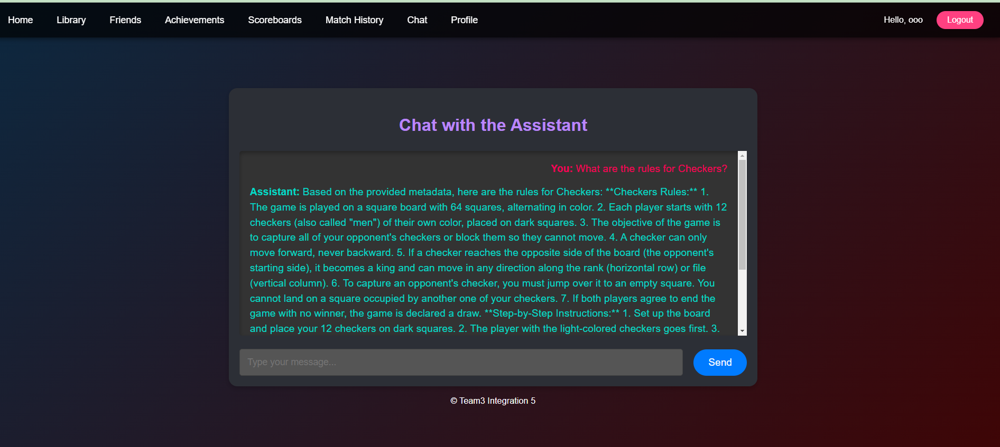

# Chatbot for Game Rules and Platform Guidance

### Integration5 Team 3

## Project Overview

This project implements a chatbot designed to assist users with:
- **Game Rules**: Providing step-by-step instructions for games like Checkers.
- **Platform Guidance**: Offering tips and navigation support for users interacting with the game platform.

The chatbot uses **FastAPI**, **LangChain**, and **Ollama** to process and retrieve relevant information and generate meaningful responses.

---

### Watch the demo
[](https://www.youtube.com/watch?v=jL-ZSRnhiP0)

---

## Features

- **Game Rules Assistance**: Simplifies complex game rules into clear and actionable instructions.
- **Platform Usage Guidance**: Helps users navigate the platform with ease.
- **Customizable Embedding Models**: Powered by Ollama's embeddings for precise query matching.
- **Scalable Design**: Easily extensible to accommodate new games and platform features.

---

## Setup and Installation

### Prerequisites
- **Python 3.9+**
- **Docker**
- **FastAPI**
- **LangChain**
- **Ollama**

### Installation Steps
1. Clone the following repositories:
- Download Ollama to your local system
- Clone chatbot repo
- Clone game-platform repo
- Clone game-platform frontend repo

   ```bash
   git clone <repository-url>
   cd chatbot
    ```
2. Install the required dependencies:
    ```bash
    python -m venv .venv
    source .venv/bin/activate
    pip install -r requirements.txt
    ```
3. Pull Ollama models
    ```bash
    ollama pull llama3.2:3b
    ollama pull mxbai-embed-large
    ```
4. Make sure you run the game-platform backend and frontend beforehand

5. Run the application locally:
    ```bash
    uvicorn chatbot:app --host 0.0.0.0 --port 3000 --reload
    ```
6. Access frontend via http://localhost:5173/
</img>
</img>

## Environment Variables
| Variable         | Description                                      | Default Value              |
|-------------------|--------------------------------------------------|----------------------------|
| `ENVIRONMENT`    | Specifies the deployment environment (`local` or `azure`). | `local`                    |
| `OLLAMA_URL`     | URL for the Ollama LLM API.                      | `http://localhost:11434`   |
| `FILES_DIR`      | Directory path for storing JSON files with game rules and platform guidance. | `/files`                   |
| `VECTORSTORE_DIR`| Directory path for storing vector embeddings.    | `chroma_db`                |
| `FRONTEND_URLS`  | Comma-separated list of allowed frontend URLs for CORS. | `http://localhost:5173`    |
| `BACKEND_URLS`   | Comma-separated list of allowed backend URLs for CORS. | `http://localhost:8090`    |
